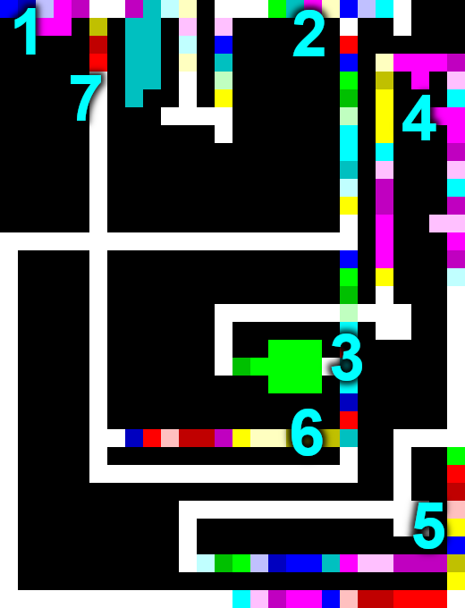

I set an ill-advised goal as part of my [plan to write code in 100 programming languages](100-languages.md) (an ill-advised goal in itself):

**Use [Piet](https://www.dangermouse.net/esoteric/piet.html) to solve a nontrivial problem from [Project Euler](https://projecteuler.net/).**

(Piet is an esoteric programming language that uses images as code, with pixel count/hue/shade corresponding to instructions for a stack-based virtual machine.)

# Summary
I *did* manage to solve [problem 34](https://projecteuler.net/problem=34) using Piet, but it required careful planning and some tedious ~~rewrites~~ repaints.

Here's the solution, enlarged to show texture:


# Approach
Problem 34 requires adding up all numbers where the sum of their digits' factorials equals the number itself. I specifically chose this problem because **it is fairly simple and doesn't require any special input, but is not *so* simple that solving it would be trivial**.

Given that Piet's instructions are all context-dependent (the color of an instruction depends on the color of the previous block) and it uses a stack for all arithmetic/input/output/manipulation, I made a plan to tackle the "stack" part first (prior to painting anything):

1. Solve the problem in Forth (a stack-based language)
1. Re-solve the problem in Forth using only Piet's instructions (except for branching, which is done graphically)
1. Translate the Forth-based solution into Piet
1. Add some colored rectangles (because: art)

# Implementation

## Forth solution
After a bit of stack-wrangling, I came up with this solution in Forth (which doesn't use any variables):

```forth
( Project Euler problem 34, in Forth )

: log dup . ;

: factorial ( n -- n! )
    1 swap begin dup 0 > while dup rot * swap 1 - repeat drop ;

: div-mod ( x y -- q r )
    over over / rot rot mod ;

: sum-digit-factorials ( n -- sum)
    0 swap begin dup 0 > while 10 div-mod factorial rot + swap repeat drop ;

: main-loop ( sum counter -- sum counter )
    dup dup sum-digit-factorials = if dup rot + log swap then 1 + ;

: main 0 3 999999 0 do main-loop loop ;

main
```

## Piet-flavored Forth
Next, I modified the Forth code to use Piet's primitives (except for branches, which are mostly implemented graphically). This was done in a few steps:

1. Avoid directly using large numbers (since directly pushing N requires painting N pixels)
1. Replace `do` with a `while` loop
1. Implement Forth words in Piet, as "macros" (which I will later manually expand when painting the actual Piet image)

Result:

```forth
( Project Euler problem 34, in Forth, but using Piet primitives )

( Piet macros )
( : swap 2 1 roll ; )
( : rot 3 2 roll ; )
( : rot2 3 1 roll ; )
( : over2 dup 3 2 roll dup 3 1 roll 4 1 roll ; )
( : = - not ; )

( Implementation using Piet primitives (except for loops, which are graphical in Piet) )

: rot2 rot rot ;
: over2 over over ;

: factorial ( n -- n! )
    1 swap begin dup 0 > while dup rot * swap 1 - repeat drop ;

: div-mod ( x y -- q r )
    over2 / rot2 mod ;

: sum-digit-factorials ( n -- sum)
    0 swap begin dup 0 > while 10 div-mod factorial rot + swap repeat drop ;

: main-loop ( sum counter -- sum counter )
    dup dup sum-digit-factorials = if dup rot + swap then 1 + ;

: main 0 3 begin dup 10 10 10 10 10 * * * * - while main-loop repeat drop . ;

main
```

## Using Piet, for real
For authoring the image, I used [this browser-based Piet editor (and interpreter)](https://piet.bubbler.one/).

Translating into Piet was excruciatingly tedious because:

* Opcodes are based on the relative hue/lightness of the previous color block, so **correcting a mistake usually entails rewriting the entire rest of the chunk** (unless you separate everything with ugly white blocks)
* **There is no way to add comments to your code** (other than maybe screenshotting a scaled up image and writing on it)
* **Branches are represented graphically** and you have to ensure there is space for e.g. return lines (all using Zoolander-style clockwise-only turns)

Luckily, I only had to correct a handful of mistakes.

Here's what my solution looked like (with points of interest marked):



Explanation:

1. Start (`main` in the Forth code above)
2. Test for "checked enough numbers to be done" (the program ends near the upper-right; otherwise, run `main-loop`)
3. Check for any digits left in the current number (the loop in `sum-digit-factorials`)
4. Compute quotient and remainder (i.e. extract a digit--still in `sum-digit-factorials`)
5. Compute factorial of digit (`factorial`)
6. Check if sum of digit factorials equals the number (the `if` part of `main-loop`)
7. Move on to the next number

N.B. I set the limit (#2) lower for the Piet version just to ensure the program ran in a reasonable amount of time. It still produces the correct answer, but I don't have any mathematical analysis to justify lowering the limit from 7 digits down to 5.

## Art
Given that Piet code is an image, the final step is to add prettily colored rectangles. Here is the final *unscaled* solution (which you can theoretically run via a Piet interpreter):


# Final thoughts
Overall, once I had a Forth-simple solution with a minimum of stack manipulation, translating it into Piet was straight-forward (although I shudder to think about graphically arranging a more complicated Piet program).

**But the satisfaction of having written a real program in a 2D esoteric language like Piet is real.**

How often can you sit back and visually admire a program? Piet is a wonderfully unique entry in the world of esoteric programming languages!

# Appendix
To my amazement, someone created a [Piet assembler](https://www.toothycat.net/wiki/wiki.pl?MoonShadow/Piet) that can translate from an assembly language into a Piet-compatible image. It's an incredible achievement, but I wanted to write my Piet solution by hand.
