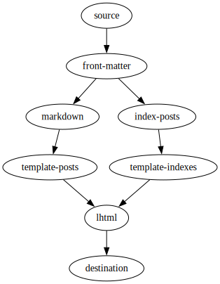
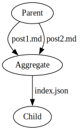
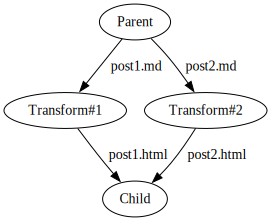

In [a recent post about speeding up md2blog](speeding-up-rebuilds-4.md) (the [Deno/TypeScript-based static site generator I created for this site](https://jaredkrinke.github.io/md2blog/)), I gloated about suppressing the urge to build [yet another](pre-markdown.md) static site generator:

> I have successfully staved off the urge ... to create yet another static site generator by instead making md2blog ... *just fast enough* ... that it seems pointless to bother improving upon its performance.

**This is the inevitable follow-up post where I describe the new static site generator I ended up building**, this time using Common Lisp.

# Motivation
I'll discuss differentiators next, but my personal motivation for creating this static site generator is some combination of the following:

* [I've been learning Common Lisp](../programming-languages/learning-lisp-in-2023.md) (to sample REPL-driven development, macros, etc.) and I wanted to build a small-but-nontrivial project to help me learn (aside: I'm also curious about performance with [SBCL](https://www.sbcl.org/))
* I wanted to try building an extensible static site generator (like [Metalsmith](metalsmith.md)) that natively supports incremental rebuilds

In other words: **for fun**.

# Differentiators
Fun is fun, but am I just reinventing the wheel? Hopefully not. I fully expect no one else will use this static site generator (assuming I even *complete* it), but I think it does have a unique combination of features, including:

* Being based around a **completely generic and extensible pipeline** (sort of a "static site generator toolkit", similar to Metalsmith)--theoretically, it's not even limited to web pages (or even the file system)
* Having **fast incremental rebuilds** natively supported, without having to prescriptively list the inputs and outputs of each step
* Using a **template system that is based entirely on list processing** (the "Lisp" part of "Common Lisp")
* Providing a **built-in debugger** (this one is kind of cheating since it comes for free with Common Lisp)

# Architecture
## Pipeline
For maximum flexibility, this static site generator is based on a generic processing pipeline, represented as a **directed acyclic graph of processing nodes**.

Here's a description of a blog pipeline, with one bullet per node:

* Enumerate files from the input directory
* Extract front matter (metadata) from Markdown files
* Convert Markdown into a tree-based document format
* Create an index of all posts
* Create index and archive pages
* Render tree format into HTML
* Write HTML files out to the output directory

In image form (note: the pipeline definition in code is shown later):



## Node types
So far, this sounds like Metalsmith's declarative JSON-based "plugin chain". Here's the twist:

There are two main node types:

* **Aggregate nodes**: Similar to Metalsmith plugins, these nodes operate over the entire set of files/items and produce multiple outputs (and can remove items, too), i.e. they are M:N (M inputs and N outputs)
* **Transform nodes**: These are 1:N nodes which only consume a single input file/item (but can still produce N outputs)

For example, here are two hypothetical nodes: an aggregate node that combines metadata from two Markdown posts ("post1.md" and "post2.md") into a single index ("index.json"), and a transform node that converts Markdown to HTML -- note that the transform node processes each item in isolation.

 

Explicitly expressing 1:N transform nodes is the primary innovation (although I'm sure--at least I hope--this has been done before, somewhere). Here are the benefits:

* **Single-item transformations can be run in parallel**
* **Only *new or modified* input items need to be transformed** when rebuilding (updating)

I [experimented with a similar approach using GNU Make in the past](speeding-up-rebuilds-2.md), but besides being slow (because it spun up a new process for processing each input), it was also cumbersome, requiring hand-crafting patterns and adding kludges to detect zombie files that should be deleted.

### Under the hood
Internally, the processing pipeline actually operates over "changes". For example, if a file gets added or modified in the source directory, an `:update` event is propagated down the pipeline; if a file is deleted, a `:delete` event is sent. There are two additional node types that operate directly upon changes:

* **Source nodes**: Create changes (e.g. based on seeing if the contents of a directory have changed)
* **Sink nodes**: Consume changes (e.g. write `:update`'d files to disk or remove `:delete`'d files)

Each node maintains a snapshot of inputs and outputs and they will only run when their input actually changes (item contents and/or metadata). Transform nodes also maintain a map of inputs *to* outputs (to handle deletions, implicit or explicit).

### Node types example
Here's the blog pipeline from before with each node type in parentheses:

* Enumerate files (**source node**)
* Extract front matter (metadata) (**transform node**)
* Convert Markdown into a tree (**transform node**)
* Create an index (**aggregate node**)
* Create index/archive pages (**transform node**)
* Render HTML (**transform node**)
* Write HTML files (**sink node**)

Note that when a single Markdown post is updated, the transform nodes only need to process the updated item(s) (if any).

## Item representation
Items are represented by three pieces of information:

* **Path**: UNIX-style pathname, relative to the source directory
* **Content**: file content, in any format--even just a pathname for e.g. pass-through static assets
* **Metadata**: an bag of arbitrary properties (currently using an association list)

## Templates/HTML representation
**I hate most static site generators because I hate the template languages they use**. Especially the one Hugo uses. Sometimes, it's just the verbose syntax for inserting a value that I dislike. Other times, it's the bespoke conditional/loop syntax that I grudgingly have to learn.

A corollary to [Greenspun's tenth rule](https://en.wikipedia.org/wiki/Greenspun's_tenth_rule) seems appropriate:

> Any sufficiently complicated ~~C or Fortran program~~ *HTML template language* contains an ad hoc, informally-specified, bug-ridden, slow implementation of half of Common Lisp.

The obvious solution is to simply embrace Common Lisp's list processing. Here's an example of the list format I'm using:

```lisp
(:p "Here is a "
    (:a :href "https://log.schemescape.com/" "link!"))
```

Rendered to HTML:

```html
<p>Here is a <a href="https://log.schemescape.com/">link!</a></p>
  ```

So that's the "list" part.

The "processing" part is **literally just Common Lisp code**. No weird syntax, just a standardized language that's been kicking around for decades. Although I haven't implemented it yet, this should also make validating relative links at build-time trivial since I only need to walk lists (something Lisp does with ease).

For the record, I did not use [CL-WHO](https://edicl.github.io/cl-who/) because it doesn't escape strings by default and I didn't use [Spinneret](https://github.com/ruricolist/spinneret) because it has ~20 dependencies.

# Current status
Here's what I've implemented so far:

* Pipeline, node, and item representation
* Directory enumeration
* Prototype YAML and Markdown parsing (although both will need to be replaced)
* HTML templates
* Prototype blog pipeline (minus an Atom feed and site map)

There's quite a bit of work remaining:

* Parallel transformations (should be trivial with [lparallel](https://github.com/lmj/lparallel))
* Find and integrate a more robust Markdown parser
* Add a live-reloading web server
* Add Atom feed (and possibly site map) support to the blog pipeline
* Consider adding build-time syntax highlighting
* Persist intermediate objects to disk
* Document everything

## Performance
Given that the implementation is incomplete, I don't want to read too much into its performance. For my site, I expect it to be fast because updating a single blog post will only require rebuilding the edited post, possibly the index/archive/post index pages, and possibly the Atom feed (**roughly a 30x reduction in the number of files being written** for my smallish site).

On my netbook where I finally got md2blog live rebuilds down to 200ms, the prototype blog could complete an incremental rebuild for a single post update in 80ms--and that's with a slow (and brittle) Markdown processor that needs to be replaced.

## Code
**Currently, the code is a complete mess**. It's all one big file with a million TODOs and at least one gratuitous macro. It's a work-in-progress, and code cleanup isn't even in my top ten concerns right now.

Honestly, I don't even want to share the code because it's so ugly, but since you can easily find it, I'll just save you the trouble:

[https://github.com/jaredkrinke/cl-stuff/blob/main/ssg/ssg.lisp](https://github.com/jaredkrinke/cl-stuff/blob/main/ssg/ssg.lisp)

### Pipeline example
Here is an example of the previous blog pipeline expressed in code:

```lisp
(defparameter *pipeline*
  '((source :children (front-matter))
    (front-matter :children (markdown
                             index-posts))
    (markdown :children (template-posts))
    (template-posts :children (lhtml))
    (index-posts :children (template-indexes))
    (template-indexes :children (lhtml))
    (lhtml :children (destination))
    (destination)))
```

The first symbol in each list is the name of a node class. Arcs/arrows can be added via either `:children` or `:parents`. I prefer to use `:children` because it seems more intuitive to think of the way items flow through the pipeline (source -> front-matter -> markdown -> template-posts -> lhtml -> destination).

## Name
So what is this new static site generator called? Well, that's *also* not in my top ten concerns right now. The Common Lisp package is just named `SSG` as a placeholder. **Hopefully I'll think of a catchy name eventually**.

# The end
And apologies for creating yet another static site generator. At least I didn't create a new front-end framework for JavaScript!
