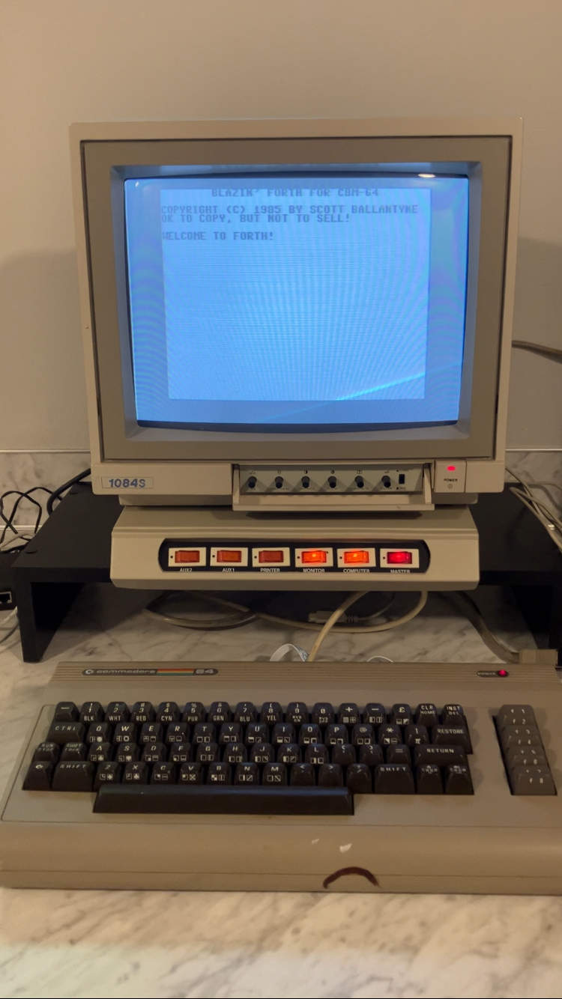

Lately, my computing interests have revolved around the following:

* Exploring programming languages ([50+ so far](../programming-languages/50-different-languages.md))
* Testing out [minimal development environments](../programming-languages/minimal-dev-env.md)
* [Playing with vintage computers](../retrocomputing/amiga-day-project-euler.md)

Thanks to some generosity and good luck, I just acquired a "new" computer on which all three interests can converge:

That's an original Commodore 64. Also known as [the first computer I ever used](../programming-languages/minimal-dev-env.md#back-in-my-day). It sports a 1 MHz 8-bit CPU and 64 KB of RAM. Aside: despite these outdated specs, **the C64 boots faster than any modern computer**--it's practically instantaneous.

Given that the C64 is one of the most popular computers of all time (per Guinness), it supports [a multitude of programming languages](https://www.lyonlabs.org/commodore/onrequest/collections.html), including:

* Assembly
* BASIC
* C
* COBOL
* Forth
* FORTRAN
* Lisp
* Logo
* Pascal
* Prolog

There's even, apparently, [a 16 KB minimal JVM](https://www.lyonlabs.org/commodore/onrequest/nanovm-announce.txt).

# The plan
Obviously, the task at hand is to **solve a few Project Euler problems using a mid-80s development environment**. I've [already sovled a problem using Commodore BASIC](../programming-languages/100-languages-4.md#commodore-basic) (using an emulator, since I didn't have a C64 at the time), so next up I'm looking at the following (likely in this order):

1. **Blazin' Forth**, by Scott Ballantyne (1985)
2. **MicroLisp**, by Nicholas Vrtis (1986)
3. **G-Pascal**, by Nick Gammon (1982)

## Blazin' Forth
I've actually spent a bit of time tinkering with Blazin' Forth already. So far, it feels like a supremely authentic implementation of Forth. Notably, **Blazin' Forth feels like a self-contained little operating system**--it even implements its own line-based text editor and block-based storage--no file system needed. Note: in the long run, I'm not sure this is a good tradeoff, but from a self-hosting and bootstrapping perspective, it's nifty (also: did I mention there's only 64 KB of RAM?).

That's all I have for now. Until next time!
