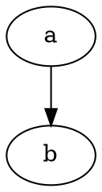

After successfully [passed strings back and forth between WebAssembly and JavaScript](passing-strings-to-c.md), and [linked against a C standard library](c-standard-library-example.md) (all without Emscripten... or Python), I felt ready to try compiling a substantial library to WebAssembly for use in Node.

# Graphviz
Specifically, I wanted to be able to automatically generate diagrams (in [SVG](https://en.wikipedia.org/wiki/Scalable_Vector_Graphics) format) from text descriptions when building my static site using [Metalsmith/Node](../static-site-generators/metalsmith.md). [Graphviz](https://graphviz.org/) is an old package of tools and libraries (written in C) that I've successfully used in the past.

Graphviz diagrams are described in a language called [DOT](https://graphviz.org/doc/info/lang.html). Example:

Graphviz supports multiple layout engines, but I've only ever needed to use the default [dot](https://graphviz.org/docs/layouts/dot/) engine (yes, it's the same name, just in lower case).

## Prior ports
The Graphviz site [lists a number of previous ports of Graphviz](https://graphviz.org/resources/), including a couple that are relevant for Node:

* [viz.js](https://github.com/mdaines/viz.js/) (compiled to [asm.js](http://asmjs.org/) using Emscripten; [live editor here](http://viz-js.com/))
* [@hpcc-js/wasm](https://www.npmjs.com/package/@hpcc-js/wasm) (compiled to WebAssembly using Emscripten)

Honestly, either one of these would have probably worked for my original purpose, but I had already decided to try building Graphviz myself before I ran across these. I also hoped that if I ripped out functionality I didn't need (e.g. export to *any format except SVG*), I might end up with a smaller WebAssembly module.