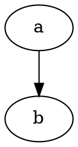
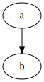

After successfully [passed strings back and forth between WebAssembly and JavaScript](passing-strings-to-c.md), and [linked against a C standard library](c-standard-library-example.md) (all without Emscripten... or Python), I felt ready to try compiling a substantial library to WebAssembly for use in Node.

# Graphviz
Specifically, I wanted to be able to automatically generate diagrams (in [SVG](https://en.wikipedia.org/wiki/Scalable_Vector_Graphics) format) from text descriptions when building my static site using [Metalsmith/Node](../static-site-generators/metalsmith.md). [Graphviz](https://graphviz.org/) is an old package of tools and libraries (written in C) that I've successfully used in the past.

Graphviz diagrams are described in a language called [DOT](https://graphviz.org/doc/info/lang.html). Example:



Graphviz supports multiple layout engines, but I've only ever needed to use the default [dot](https://graphviz.org/docs/layouts/dot/) engine (yes, it's the same name, just in lower case).

## Prior ports
The Graphviz site [lists a number of previous ports of Graphviz](https://graphviz.org/resources/), including a couple that are relevant for Node:

* [viz.js](https://github.com/mdaines/viz.js/) (compiled to [asm.js](http://asmjs.org/) using Emscripten; [live editor here](http://viz-js.com/))
* [@hpcc-js/wasm](https://www.npmjs.com/package/@hpcc-js/wasm) (compiled to WebAssembly using Emscripten)

Honestly, either one of these would have probably worked for my original purpose, but I chose to compile Graphviz myself for a few reasons:

* I wanted to experiment with compiling an existing C library to WebAssembly
* I hoped that if I ripped out functionality I didn't need (e.g. export to *any format except SVG*), I might end up with a smaller WebAssembly module
* I thought that a simple DOT-to-SVG function would avoid taking dependencies on "virtual" file I/O, etc. (which I assumed is how Emscripten worked)

# dot2svg.wasm
Given that I'm only interested in DOT diagram description to SVG, I decided to export a single function named `dot2svg` (along with exporting `malloc`/`free`/memory). There were a few reasons for this:

* The module should be smaller since it only contains the minimum essential code
* I may be able to avoid dealing with build errors in code that I don't need
* Theoretically, I can avoid dealing with file input/output, since everything is just strings in memory (spoiler: this didn't quite work out)

The module's C code is pretty simple. Other than memory management functions, there's only one export and it takes a C string (in DOT format), renders to SVG, and returns a newly allocated string with the SVG content (the JavaScript host is responsible for freeing the string after it's been decoded).

Here's the C code for my module:

```c
#include <malloc.h>
#include <string.h>
#include <gvc.h>

#define WASM_EXPORT_AS(name) __attribute__((export_name(name)))
#define WASM_EXPORT(symbol) WASM_EXPORT_AS(#symbol) symbol

// WebAssembly exports
// Memory management helpers
void* WASM_EXPORT(allocate)(unsigned int size) {
    return malloc(size);
}

void WASM_EXPORT(deallocate)(void* allocation) {
    free(allocation);
}

// Main export
const char* WASM_EXPORT(dot2svg)(const char* graphString) {
    // Use Graphviz for converting dot to SVG
    const char* result = NULL;
    GVC_t* context = gvContextPlugins(lt_preloaded_symbols, false);
    if (context) {
        Agraph_t* graph = agmemread(graphString);
        if (graph) {
            if (gvLayout(context, graph, "dot") == 0) {
                char *svg;
                unsigned int svgLength;
                gvRenderData(context, graph, "svg", &svg, &svgLength);
                if (svg) {
                    result = strdup(svg);
                    gvFreeRenderData(svg);
                }
                gvFreeLayout(context, graph);
            }
            agfree(graph, NULL);
        }
        gvFreeContext(context);
    }

    return result;
}

```

## Initial attempt at compiling
First, I cloned the Graphviz repository (actually, I added it as a submodule--anticipating the need to make changes) and ran it's "autogen.sh" script. For the record, I'm using Debian [Stretch](https://www.debian.org/releases/stretch/) on the [Windows Subsystem for Linux](https://docs.microsoft.com/en-us/windows/wsl/).

Being familiar with [GNU Autotools](https://www.gnu.org/software/automake/manual/html_node/Autotools-Introduction.html), I hoped that I'd then be able to simply run Graphviz's "configure" script with appropriate arguments ("--host=wasm32"?) and environment variables ("CC=/opt/wasi-sdk/bin/clang"?) and everything would build fine.

I hit a few snags:

* Some of the Graphviz source code is actually C++, so I needed to set the "CXX=/opt/wasi-sdk/bin/clang++" variable as well
* Graphviz defaults to building a shared library, but I needed a static one (solution: add "--disable-shared" to the "configure" command)
* Graphviz defaults to loading plugins dynamically by enumerating directories (solution: add "--disable-ltdl" when running "configure")
* "wasm-ld: error: ... archive has no index; run ranlib to add one"

That last one required some investigation.

## Archive index error
After searching for and finding a [similar issue on GitHub](https://github.com/emscripten-core/emscripten/issues/9329), I learned that that `wasm-ld` error means that you created the archive with the wrong tool set. In my case, it was using GNU `ar` instead of LLVM `ar`. That makes sense because I didn't tell the build to use a different `ar`, and GNU `ar` was on my path.

I thought that setting the "AR" environment variable would solve this, but it turned out that the Autotools in use didn't respect that environment variable. My hacky solution to this (and possibly other mismatched tools) was to just move the WASI SDK to the front of my "PATH" variable in my build script:

```sh
export PATH="/opt/wasi-sdk/bin:$PATH"
```

## More issues
Now I started to run into more WASI-related issues. WASI is still in development and may not ever support the entire C library. That's fine, and I knew that going in, but I thought that Graphviz wouldn't be relying on some of the more obscure parts of the C library (and hopefully very few OS-specific features). Sadly, this is not the case.

Here are the problems I ran into:

* "setjmp.h": apparently some Graphviz code uses one of my least favorite headers in the entire C standard library: "setjmp.h"
  * This header provides non-local jumps that are sometimes used as an ugly substitute for exceptions
  * Unsurprisingly, WASI doesn't support this (I don't even think it *should*)
  * My solution was to just hope that `longjmp` never gets called and link in my own no-op versions of `setjmp` and `longjmp`
* "sys/wait.h": this is a POSIX header that Graphviz doesn't need (e.g. on Windows)
  * My work-around was to create a dummy header that tricked Graphviz into thinking the one file including this header was on Windows
  * The contents of my dummy header: `#define _WIN32`
* "signal.h": WASI contains a header for this, but it annoyingly just reports an error
  * My awful solution to this was to trick WASI into going into the "no error" fork, but without actually doing anything useful
  * All I did was add "-D_WASI_EMULATED_SIGNAL -D_SIGNAL_H" to my "CFLAGS" environment variable
* "pwd.h": Another (missing, for me) POSIX header
  * Hack: add a dummy header that defines `R_OK` and `SIGUSR1`

At this point, I was (mostly) able to compile the libraries I needed, but not link.

Also, at this point, I was starting to appreciate just how much Emscripten must handle to support building stuff like this without any modifications. Maybe my main takeaway will just be to use Emscripten in the future?

## Slimming down Graphviz
For my purposes, I only needed to be able to parse DOT input, using the "dot" layout engine, and output to SVG. But Graphviz's default library has support for many outputs, including [Adobe PostScript](https://www.adobe.com/products/postscript.html), which I *definitely* have no plans to use. These defaults are encoded directly into "graphviz/plugin/core/gvplugin_core.c".

In order to reduce the list down to just SVG, I needed to create my own "plugin" that only supported DOT and SVG. Here's what that looked like:

```c
#include <gvplugin.h>

extern gvplugin_installed_t gvdevice_dot_types[];
extern gvplugin_installed_t gvdevice_svg_types[];
extern gvplugin_installed_t gvrender_dot_types[];
extern gvplugin_installed_t gvrender_svg_types[];
extern gvplugin_installed_t gvloadimage_core_types[];

static gvplugin_api_t apis[] = {
    {API_device, gvdevice_dot_types},
    {API_device, gvdevice_svg_types},
    {API_render, gvrender_dot_types},
    {API_render, gvrender_svg_types},

    {(api_t)0, 0},
};

gvplugin_library_t gvplugin_core_LTX_library = { "core", apis };

#define IMPORT /* nothing */

IMPORT extern gvplugin_library_t gvplugin_dot_layout_LTX_library;
IMPORT extern gvplugin_library_t gvplugin_core_LTX_library;

lt_symlist_t lt_preloaded_symbols[] = {
	{ "gvplugin_dot_layout_LTX_library", (void*)(&gvplugin_dot_layout_LTX_library) },
	{ "gvplugin_core_LTX_library", (void*)(&gvplugin_core_LTX_library) },
	{ 0, 0 }
};
```

This also had the benefit of removing a number of dependencies (including some that weren't yet building successfully for me yet).

## One last link error
At this point, I was down to a final error from the linker. It turns out that, somewhere in Graphviz, it uses the `tmpfile` function. For now, I just decided to add a dummy implementation and hope that it wasn't being used for anything important:

```c
FILE* tmpfile() {
    return 0;
}
```

## Successful build
Finally, I was able to successfully build "dot2svg.wasm". The uncompressed file size ended up being around 660 KB--a bit larger than I hoped, but not huge.

Now I just have to run that function... right?

# JavaScript side
Given that I already had code to pass strings back and forth, I hoped I could just call the `dot2svg` export and bask in the glorious result. But I wasn't quite there yet.

## Imports
On the first run, I got the following error:

```
TypeError: WebAssembly.instantiate(): Imports argument must be present and must be an object
```

That's too bad. I was hoping that my slimmed down Graphviz build wouldn't expect the host to provide any functions. Let's see what's missing:

```sh
$ wasm2wat dot2svg.wasm|findstr /i import
  (import "wasi_snapshot_preview1" "clock_time_get" (func $__wasi_clock_time_get (type 16)))
  (import "wasi_snapshot_preview1" "fd_filestat_get" (func $__wasi_fd_filestat_get (type 1)))
  (import "wasi_snapshot_preview1" "proc_exit" (func $__wasi_proc_exit (type 10)))
  (import "wasi_snapshot_preview1" "fd_fdstat_get" (func $__wasi_fd_fdstat_get (type 1)))
  (import "wasi_snapshot_preview1" "path_open" (func $__wasi_path_open (type 17)))
  (import "wasi_snapshot_preview1" "path_filestat_get" (func $__wasi_path_filestat_get (type 7)))
  (import "wasi_snapshot_preview1" "fd_close" (func $__wasi_fd_close (type 0)))
  (import "wasi_snapshot_preview1" "environ_sizes_get" (func $__wasi_environ_sizes_get (type 1)))
  (import "wasi_snapshot_preview1" "environ_get" (func $__wasi_environ_get (type 1)))
  (import "wasi_snapshot_preview1" "fd_seek" (func $__wasi_fd_seek (type 18)))
  (import "wasi_snapshot_preview1" "fd_write" (func $__wasi_fd_write (type 4)))
  (import "wasi_snapshot_preview1" "fd_read" (func $__wasi_fd_read (type 4)))
  (import "wasi_snapshot_preview1" "fd_fdstat_set_flags" (func $__wasi_fd_fdstat_set_flags (type 1)))
```

## Do the imports really matter?
That's a longer list than I expected. Ok, well let's see if they're *really* needed by providing no-op implementations:

```javascript
    const module = await WebAssembly.instantiate(await fs.promises.readFile("./dot2svg.wasm"), {
        wasi_snapshot_preview1: {
            // Not implemented
            clock_time_get: () => {},
            environ_get: () => {},
            environ_sizes_get: () => {},
            fd_close: () => {},
            fd_fdstat_get: () => {},
            fd_fdstat_set_flags: () => {},
            fd_filestat_get: () => {},
            fd_read: () => {},
            fd_seek: () => {},
            fd_write: () => {},
            path_filestat_get: () => {},
            path_open: () => {},
            proc_exit: () => {},
        },
    });
```

Unfortunately, with those no-op functions, my test script just seemed to spin.

## fd_write
Debugging showed that `fd_write` was being called repeatedly. That makes me think that WASI actually needs `fd_write` to do something. With absolutely zero context, the function name sounds like it's writing to a file descriptor.

After some digging, I found a helpful note in the (otherwise inscrutable) [WASI documentation](https://github.com/WebAssembly/WASI/blob/main/phases/snapshot/docs.md#-fd_writefd-fd-iovs-ciovec_array---resultsize-errno):

> fd_write(fd: fd, iovs: ciovec_array) -> Result<size, errno>
>
> Write to a file descriptor. Note: This is similar to writev in POSIX.

### writev
Fortunately, `writev(2)` is [extensively documented](https://linux.die.net/man/2/writev).

The first argument is indeed a file descriptor. Debugging my test app showed that the function was being called with file descriptor 2, which is Standard Error. It's my opinion that libraries shouldn't directly write anything to Standard Output or Error, but I didn't write Graphviz. A quick scan of the Graphviz source indicated that I couldn't easily disable console logging.

The second argument to `writev` is an array of I/O vectors defined as follows:

```c
struct iovec {
    void  *iov_base;    /* Starting address */
    size_t iov_len;     /* Number of bytes to transfer */
};
```

And the return value is just the number of bytes written.

### JavaScript implementation
Assuming that `fd_write` is the same (assuming 32-bit WebAssembly), this isn't too bad to implement (and I decided to forward to the console for testing purposes). The only remaining trick is that `fd_write` supplies the memory address for the return value as the third argument and directly returns a status code (zero for success).

Here's a simple implementation:

```javascript
fd_write: (fileDescriptor, ioVectorsBaseAddress, ioVectorsCount, returnBytesWrittenAddress) => {
    // Read IO vectors
    const view = new DataView(memory.buffer);
    const ioVectors = [];
    for (let i = 0, address = ioVectorsBaseAddress; i < ioVectorsCount; i++, address += 8) {
        ioVectors.push({
            sourceAddress: view.getUint32(address, true),
            sizeInBytes: view.getUint32(address + 4, true),
        });
    }

    // Calculate total size
    const totalSizeInBytes = ioVectors.reduce((sum, ioVector) => sum + ioVector.sizeInBytes, 0);

    // Forward STDOUT and STDERR to console
    const standardOutput = 1;
    const standardError = 2;
    switch (fileDescriptor) {
        case standardOutput:
        case standardError:
            {
                // Copy to buffer
                const buffer = new Uint8Array(totalSizeInBytes);
                let offset = 0;
                ioVectors.forEach(ioVector => {
                    buffer.set(new Uint8Array(memory.buffer, ioVector.sourceAddress, ioVector.sizeInBytes), offset);
                    offset += ioVector.sizeInBytes;
                });

                // Note: Adds an extra new line...
                console.log(textDecoder.decode(buffer));
            }
            break;

        default:
            // Do nothing
            break;
    }

    // Set return value to total size of writes
    view.setUint32(returnBytesWrittenAddress, totalSizeInBytes, true);
    return 0; // Success
},
```

## Success!
With the above imports, [my string-passing library](https://github.com/jaredkrinke/wasm-c-string), and the following code:

```javascript
const dotString = process.argv[2] ?? "digraph { a -> b }";
createCString(module, dotString, (dotStringAddress) => {
    const svgString = receiveCString(module, () => module.instance.exports.dot2svg(dotStringAddress));
    console.log(svgString);
});
```

I was finally able to generate the following test graph SVG:



Additionally, if I deliberately insert a syntax error into the graph, I see the error logged to my console, so output forwarding is even working.

# Conclusion
There's still work I need to do around theming, packaging, and more, but as a proof of concept, it looks like compiling a C library to WebAssembly with minimal tooling beyond Clang and LLVM is certainly possible, with some perseverance.

Lessons learned:

* Always first check to see if someone has already ported the library you're interested in--if they have, and you can tolerate their dependencies, you'll save significant effort
* You can't assume that a "simple" C library won't have surprising dependencies (e.g. Graphviz depending on PostScript headers by default)
* Compiling typical C libraries to WebAssembly on Windows is painful (not discussed here, but I actually did that first, before moving to Linux for a more compiler-friendly environment)
* Emscripten will probably save you time dealing with obscure or unsupported-by-WASI headers
* WASI itself might require additional support code (there is a [poorly documented browser polyfill for WASI](https://wasi.dev/polyfill/), but I haven't tested it)

# Resources
* [Repository for this code](https://github.com/jaredkrinke/dot2svg-wasm) (as an ES module)
* [Example of using this code to generate diagrams automatically for my site](../static-site-generators/metalsmith-diagrams.md)