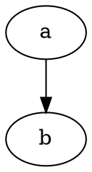

After successfully [passed strings back and forth between WebAssembly and JavaScript](passing-strings-to-c.md), and [linked against a C standard library](c-standard-library-example.md) (all without Emscripten... or Python), I felt ready to try compiling a substantial library to WebAssembly for use in Node.

# Graphviz
Specifically, I wanted to be able to automatically generate diagrams (in [SVG](https://en.wikipedia.org/wiki/Scalable_Vector_Graphics) format) from text descriptions when building my static site using [Metalsmith/Node](../static-site-generators/metalsmith.md). [Graphviz](https://graphviz.org/) is an old package of tools and libraries (written in C) that I've successfully used in the past.

Graphviz diagrams are described in a language called [DOT](https://graphviz.org/doc/info/lang.html). Example:



Graphviz supports multiple layout engines, but I've only ever needed to use the default [dot](https://graphviz.org/docs/layouts/dot/) engine (yes, it's the same name, just in lower case).

## Prior ports
The Graphviz site [lists a number of previous ports of Graphviz](https://graphviz.org/resources/), including a couple that are relevant for Node:

* [viz.js](https://github.com/mdaines/viz.js/) (compiled to [asm.js](http://asmjs.org/) using Emscripten; [live editor here](http://viz-js.com/))
* [@hpcc-js/wasm](https://www.npmjs.com/package/@hpcc-js/wasm) (compiled to WebAssembly using Emscripten)

Honestly, either one of these would have probably worked for my original purpose, but I chose to compile Graphviz myself for a few reasons:

* I wanted to experiment with compiling an existing C library to WebAssembly
* I hoped that if I ripped out functionality I didn't need (e.g. export to *any format except SVG*), I might end up with a smaller WebAssembly module
* I thought that a simple DOT-to-SVG function would avoid taking dependencies on "virtual" file I/O, etc. (which I assumed is how Emscripten worked)

# Initial attempt
First, I cloned the Graphviz repository (actually, I added it as a submodule--anticipating the need to make changes) and ran it's "autogen.sh" script. For the record, I'm using Debian [Stretch](https://www.debian.org/releases/stretch/) on the [Windows Subsystem for Linux](https://docs.microsoft.com/en-us/windows/wsl/).

Being familiar with [GNU Autotools](https://www.gnu.org/software/automake/manual/html_node/Autotools-Introduction.html), I hoped that I'd then be able to simply run Graphviz's "configure" script with appropriate arguments ("--host=wasm32"?) and environment variables ("CC=/opt/wasi-sdk/bin/clang"?) and everything would build fine.

I hit a few snags:

* Some of the Graphviz source code is actually C++, so I needed to set the "CXX=/opt/wasi-sdk/bin/clang++" variable as well
* Graphviz defaults to building a shared library, but I needed a static one (solution: add "--disable-shared" to the "configure" command)
* Graphviz defaults to loading plugins dynamically by enumerating directories (solution: add "--disable-ltdl" when running "configure")
* "wasm-ld: error: ... archive has no index; run ranlib to add one"

That last one required some investigation.

# Archive index error
After searching for and finding a [similar issue on GitHub](https://github.com/emscripten-core/emscripten/issues/9329), I learned that that `wasm-ld` error means that you created the archive with the wrong tool set. In my case, it was using GNU `ar` instead of LLVM `ar`. That makes sense because I didn't tell the build to use a different `ar`, and GNU `ar` was on my path.

I thought that setting the "AR" environment variable would solve this, but it turned out that the Autotools in use didn't respect that environment variable. My hacky solution to this (and possibly other mismatched tools) was to just move the WASI SDK to the front of my "PATH" variable in my build script:

```sh
export PATH="/opt/wasi-sdk/bin:$PATH"
```

# More issues
Now I started to run into more WASI-related issues. WASI is still in development and may not ever support the entire C library. That's fine, and I knew that going in, but I thought that Graphviz wouldn't be relying on some of the more obscure parts of the C library (and hopefully very few OS-specific features). Sadly, this is not the case.

Here are the problems I ran into:

* "setjmp.h": apparently some Graphviz code uses one of my least favorite headers in the entire C standard library: "setjmp.h"
  * This header provides non-local jumps that are sometimes used as an ugly substitute for exceptions
  * Unsurprisingly, WASI doesn't support this (I don't even think it *should*)
  * My solution was to just hope that `longjmp` never gets called and link in my own no-op versions of `setjmp` and `longjmp`
* "sys/wait.h": this is a POSIX header that Graphviz doesn't need (e.g. on Windows)
  * My work-around was to create a dummy header that tricked Graphviz into thinking the one file including this header was on Windows
  * The contents of my dummy header: `#define _WIN32`
* "signal.h": WASI contains a header for this, but it annoyingly just reports an error
  * My awful solution to this was to trick WASI into going into the "no error" fork, but without actually doing anything useful
  * All I did was add "-D_WASI_EMULATED_SIGNAL -D_SIGNAL_H" to my "CFLAGS" environment variable
* "pwd.h": Another (missing, for me) POSIX header
  * Hack: add a dummy header that defines `R_OK` and `SIGUSR1`

At this point, I was (mostly) able to compile the libraries I needed, but not link.

Also, at this point, I was starting to appreciate just how much Emscripten must handle to support building stuff like this without any modifications. Maybe my main takeaway will just be to use Emscripten in the future?

# Slimming down Graphviz
For my purposes, I only needed to be able to parse DOT input, using the "dot" layout engine, and output to SVG. But Graphviz's default library has support for many outputs, including [Adobe PostScript](https://www.adobe.com/products/postscript.html), which I *definitely* have no plans to use. These defaults are encoded directly into "graphviz/plugin/core/gvplugin_core.c".

In order to reduce the list down to just SVG, I needed to create my own "plugin" that only supported DOT and SVG. Here's what that looked like:

```c
#include <gvplugin.h>

extern gvplugin_installed_t gvdevice_dot_types[];
extern gvplugin_installed_t gvdevice_svg_types[];
extern gvplugin_installed_t gvrender_dot_types[];
extern gvplugin_installed_t gvrender_svg_types[];
extern gvplugin_installed_t gvloadimage_core_types[];

static gvplugin_api_t apis[] = {
    {API_device, gvdevice_dot_types},
    {API_device, gvdevice_svg_types},
    {API_render, gvrender_dot_types},
    {API_render, gvrender_svg_types},

    {(api_t)0, 0},
};

gvplugin_library_t gvplugin_core_LTX_library = { "core", apis };

#define IMPORT /* nothing */

IMPORT extern gvplugin_library_t gvplugin_dot_layout_LTX_library;
IMPORT extern gvplugin_library_t gvplugin_core_LTX_library;

lt_symlist_t lt_preloaded_symbols[] = {
	{ "gvplugin_dot_layout_LTX_library", (void*)(&gvplugin_dot_layout_LTX_library) },
	{ "gvplugin_core_LTX_library", (void*)(&gvplugin_core_LTX_library) },
	{ 0, 0 }
};
```

This also had the benefit of removing a number of dependencies (including some that weren't yet building successfully for me yet).

# One last linking error
At this point, I was down to a final error from the linker. It turns out that, somewhere in Graphviz, it uses the `tmpfile` function. For now, I just decided to add a dummy implementation and hope that it wasn't being used for anything important.